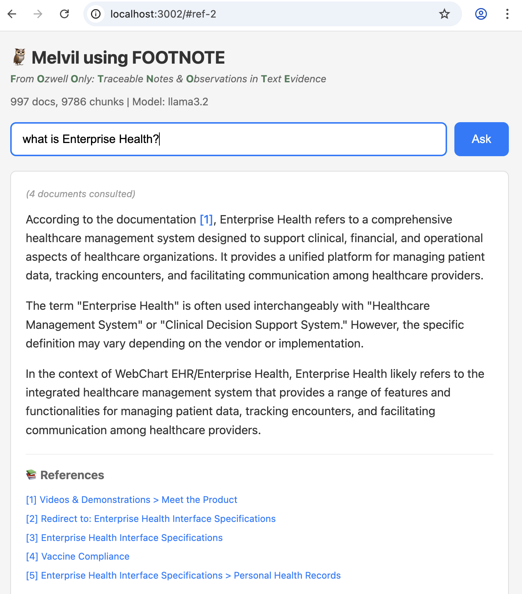

# FOOTNOTE and Melvil



[](http://www.youtube.com/watch?v=VIGd_Q-deLU "3 Min Demo of Melvil and Footnote")

<a href="https://youtu.be/VIGd_Q-deLU">Watch a 3 min demo</a>

## What is FOOTNOTE?

**FOOTNOTE** — *From Ozwell Only: Traceable Notes & Observations in Text Evidence*

FOOTNOTE is a portable index format within [Footnote Indexes](FOOTNOTE-FORMAT.md) designed for RAG (Retrieval-Augmented Generation) with proper citations. It compiles markdown documentation into a self-contained SQLite database that combines:

- **sqlite-vec** for semantic vector search (find conceptually similar content)
- **FTS5** for full-text BM25 search (find exact keywords and phrases)
- **Literal search** for special characters and code patterns (HL7 messages like `ADT^A04`)

The result is a single `index.sqlite` file that can be deployed anywhere—servers, edge functions, or even in-browser via WebAssembly.

## What is Melvil?

**Melvil** is an agentic RAG assistant (implemented in `ask.ts`) that uses FOOTNOTE indexes to answer questions with citations. Named after [Melvil Dewey](https://en.wikipedia.org/wiki/Melvil_Dewey), the inventor of the Dewey Decimal System, Melvil helps users find information in large documentation sets.

Melvil features:
- **Tool-based search**: The LLM decides which search strategy to use (hybrid, FTS, literal)
- **Multi-turn reasoning**: Can search multiple times to gather comprehensive answers
- **Citation tracking**: Every answer includes `[1]`, `[2]` references to source documents
- **Debug & reporting**: Saves conversation logs and allows users to flag bad answers for review

## Overview

This tool (docidx) is a markdown compiler that produces FOOTNOTE-enabled indexes for server-side RAG consumption. 

See https://alexgarcia.xyz/sqlite-vec/wasm.html for in browser example

## Installation

```bash
cd tools/docidx
npm install
```

## Usage

### Build Index

Smart build (auto-detects everything):
```bash
npm run docidx -- build
```

Force clean rebuild:
```bash
npm run docidx -- build --clean
```

Use specific Ollama model:
```bash
npm run docidx -- build --embedding-model ollama:nomic-embed-text
```

Use OpenAI (requires OPENAI_API_KEY):
```bash
npm run docidx -- build --embedding-model text-embedding-3-small
```

### Options

- `--root <path>` - Project root (auto-detected by finding content/ directory)
- `--content <path>` - Content directory relative to root (default: `.` i.e. the root itself)
- `--out <path>` - Output directory (default: ./.footnote relative to project root)
- `--clean` - Remove existing index and rebuild from scratch
- `--incremental` - Only process changed files
- `--include-drafts` - Include draft documents
- `--filter <name=value>` - Content filter (e.g., `--filter brand=eh`)
- `--embedding-model <model>` - Embedding model (auto-detected, see below)
- `--embedding-dim <n>` - Embedding dimensions (auto-detected based on model)
- `--pull` - Automatically pull Ollama model if not installed
- `--max-tokens <n>` - Max tokens per chunk (default: 500)
- `--overlap <n>` - Token overlap between chunks (default: 80)
- `--copy-content` - Copy markdown files to footnote index for grep-based search

**Auto-detection behavior:**
- **Project root**: Walks up from current directory looking for `content/`
- **Build mode**: Incremental if index exists, clean if not
- **Embedder**: Checks in order:
  1. **Ollama** (if running locally with embedding model like `nomic-embed-text`)
  2. **OpenAI** (if `OPENAI_API_KEY` is set)
  3. Error with helpful instructions

Supported Ollama embedding models:
- `nomic-embed-text` (768 dim) - recommended, fast
- `bge-m3` (1024 dim) - multilingual, high quality
- `mxbai-embed-large` (1024 dim)
- `bge-large` (1024 dim)
- `snowflake-arctic-embed` (1024 dim)
- `all-minilm` (384 dim) - smallest/fastest

**Installing Ollama models:**

Option 1 - Manually pull first:
```bash
ollama pull nomic-embed-text
```

Option 2 - Auto-pull with `--pull` flag:
```bash
./docidx.sh build --embedding-model ollama:bge-m3 --pull
```

### Test Query

```bash
npm run docidx -- query --hybrid "patient registration" --k 5
```

### Interactive Search Testing

Test different search modes interactively:

```bash
./docidx.sh test --mode fts "FHIR API"
./docidx.sh test --mode hybrid "how do I schedule"
./docidx.sh test --mode literal "ADT^A04"
./docidx.sh test --mode grep "copyright"   # requires --copy-content
```

### AI Agent Search

Ask questions with an agentic RAG assistant:

```bash
./docidx.sh ask "How do I schedule an appointment?"
./docidx.sh ask -v "What is FHIR?"          # verbose: show tool calls
./docidx.sh ask -c "terms of use"           # show full chunk content
```

The agent has access to these tools:
- `search_hybrid` - Vector + keyword search (best for natural language)
- `search_fts` - Full-text BM25 search (best for technical terms)
- `search_literal` - Exact substring match (finds special chars like `^`, `|`)
- `search_grep` - Unix grep on raw files (if `--copy-content` enabled)
- `read_document` - Read full document content
- `find_related` - Find documents that link to a given document

### Web Server (API POC)

The ask agent includes a built-in HTTP server that demonstrates how external applications can consume a footnote index. This serves as a **proof of concept** for building documentation assistants, chatbots, or search interfaces.

```bash
./docidx.sh ask --serve --port 3000              # Start server
./docidx.sh ask --serve --port 3000 --verbose    # With request logging
```

### MCP Server (Model Context Protocol)

The MCP server exposes footnote index search tools to AI assistants like VS Code Copilot, Claude Desktop, and Cursor. Unlike the HTTP server + ask agent, the MCP server provides **tools, not answers** — the client's LLM decides which tools to call and synthesizes the response.

```bash
docidx mcp --db ./.footnote                      # Start MCP server (stdio)
```

**Available MCP tools:** `search_hybrid`, `search_fts`, `search_literal`, `read_document`, `find_related`, `list_documents`, `search_grep` (if `--copy-content` was used at build time), `build_index` (incremental update), `rebuild_index` (clean rebuild).

**VS Code configuration** (`.vscode/settings.json` or user settings):
```json
{
  "mcp": {
    "servers": {
      "docidx": {
        "command": "npx",
        "args": ["docidx", "mcp", "--db", "/path/to/.footnote"]
      }
    }
  }
}
```

**Claude Desktop** (`claude_desktop_config.json`):
```json
{
  "mcpServers": {
    "docidx": {
      "command": "npx",
      "args": ["docidx", "mcp", "--db", "/path/to/.footnote"]
    }
  }
}
```

**Endpoints:**

| Endpoint | Method | Description |
|----------|--------|-------------|
| `/` | GET | Web UI for interactive Q&A |
| `/health` | GET | Health check + stats (doc count, chunk count, model) |
| `/ask?q=...` | GET | Ask question, returns JSON response |
| `/ask` | POST | Ask with JSON body `{"question": "..."}` |
| `/ask/stream?q=...` | GET | Streaming SSE response (real-time tokens) |

**JSON Response Format:**
```json
{
  "answer": "The patient registration process involves...",
  "references": [
    {
      "index": 1,
      "doc_id": "doc_abc123",
      "url": "/functions/patient-registration/",
      "title": "Patient Registration",
      "headings": ["Manual Entry", "Required Fields"],
      "method": "hybrid",
      "score": 0.0241
    }
  ]
}
```

**Streaming SSE Events:**
```
data: {"type": "thinking", "message": "Searching... (iteration 1)"}
data: {"type": "tool_call", "tool": "search_fts", "query": "patient registration"}
data: {"type": "token", "content": "To register"}
data: {"type": "token", "content": " a patient..."}
data: {"type": "done", "references": [...]}
data: [DONE]
```

**Building Your Own Client:**

The footnote index is designed to be consumed by any application that can:
1. Read SQLite (for direct search access)
2. Call an embedding API (Ollama/OpenAI) for vector queries
3. Optionally, wrap an LLM for agentic search

See the [SqliteStore](src/storage/sqlite.ts) class for direct database access patterns, or use the HTTP API as a simpler integration point.

## Prompt Customization and Guide
### Final Answer Signaling (`FINAL:`)

The `ask` command automatically injects a `FINAL:` answer-marker requirement into all agent prompts. This ensures reliable detection of when the LLM has finished responding, especially in tool-calling workflows where the model may emit multiple intermediate outputs.

With this injection, the agent **must output exactly one of two things**:

1. a **tool call** expressed as valid JSON only, or
2. a **completed user-facing answer prefixed with `FINAL:`** and containing no planning, narration, or tool references.

**Why `FINAL:`?** This convention avoids ambiguity in streaming and multi-turn tool workflows and is more robust than XML tags or heuristic detection. The `FINAL:` prefix is widely used in agent frameworks and has been shown in practice to be the most consistently followed boundary marker across OpenAI, Anthropic, Gemini, and Ollama-hosted models. If you provide a custom prompt via `--prompt-file`, the tool appends the `FINAL:` requirement automatically—you don't need to include it yourself.

**References / rationale**:

https://chatgpt.com/share/69805745-bfb8-8004-a6ba-2d69750cdc6a
* OpenAI & Anthropic agent patterns separating *tool calls* from *final answers*
* LangChain / LangGraph best practices for tool-calling agents
* ReAct-style prompting (Yao et al., 2022) emphasizing explicit action vs. answer boundaries
* Production experience across mixed-vendor LLM stacks showing higher compliance with simple textual sentinels than XML-style tags

## Search Performance Comparison

Benchmarked on ~1000 markdown documents (~10K chunks) on macOS:

| Search Mode | Time | Description |
|-------------|------|-------------|
| **FTS** | ~6ms | SQLite FTS5 with BM25 ranking |
| **Hybrid** | ~50ms | Vector + FTS combined (includes embedding) |
| **Literal** | ~120ms | Exact substring match via SQL LIKE |
| **Grep** | ~220ms | Unix grep on raw files |

### Example: Search for "copyright"

**FTS (SQLite) - 6ms:**
```
1. [7.71] Terms of Use > General Prohibitions
   /resources/.../terms-of-use/
   "...infringe any copyright, trademark rights..."

2. [6.86] Terms of API Use > User Content
   /resources/.../terms-of-api-use/
   "...may constitute copyright or HIPAA infringement..."
```

**Grep - 219ms:**
```
1. [5 matches] terms-of-api-use
   L43: Remember, it's not your content...
   L145: ...infringe any copyright, trademark...
   
2. [5 matches] terms-of-use
   L43: Remember, it's not your content...
```

### Key Differences

| Feature | SQLite FTS/Hybrid | Grep |
|---------|-------------------|------|
| Speed | ~36x faster | Slower (reads all files) |
| Ranking | BM25 relevance scores | Match count only |
| Results | Chunk-level with context | Line-level |
| Special chars | Tokenized (use `literal` mode) | Native support |
| Setup | Requires index build | No setup needed |

### Enabling Grep Search

To enable grep-based search (for comparison or fallback):

```bash
./docidx.sh build --copy-content
```

This copies markdown files to `.footnote/content/` (~3MB for 1000 docs).

## Environment Variables

- `OPENAI_API_KEY` - Required only if using OpenAI embeddings (not needed for Ollama)
- `LOG_LEVEL` - Logging verbosity (debug, info, warn, error)

## Footnote Index Structure

See [FOOTNOTE-FORMAT.md](FOOTNOTE-FORMAT.md) for the full specification.

```
.footnote/
├── index.sqlite           # SQLite database (vectors + FTS)
├── manifest.json          # Build metadata and configuration
├── .embed-{model}/        # Embedding cache (e.g., .embed-nomic-embed-text)
│   └── {hash[0:2]}/       # Subdirectories by 2-char hash prefix
│       └── {hash[2:]}.bin # Binary Float32 embedding vectors
└── content/               # (optional) Raw markdown for grep search
```

### Embedding Cache

The `.embed-{model}` folder caches embeddings by content hash to avoid re-vectorizing unchanged chunks across builds. This provides significant speedups for incremental builds where only a few documents change.

- **Location**: `{.footnote}/.embed-{model}` (e.g., `.embed-nomic-embed-text`)
- **Format**: Binary Float32Array files (~3KB per 768-dim embedding)
- **Organization**: Files are stored in subdirectories by 2-char hash prefix (e.g., `ab/cdef1234.bin`) to avoid slow directory listings when cache contains tens of thousands of entries
- **Benefits**: 
  - Rebuilds with unchanged content are nearly instant (only metadata updates)
  - Switching between clean/incremental builds reuses cached embeddings
  - Cache persists even if the SQLite database is deleted

The cache is model-specific, so switching embedding models creates a new cache folder.

### index.sqlite Schema

| Table | Purpose |
|-------|---------|
| `chunks` | Main chunk metadata (doc_id, path, url, title, section, tags, headings, content, content_hash) |
| `vec_chunks` | sqlite-vec virtual table for vector KNN search |
| `chunks_fts` | FTS5 virtual table for BM25 full-text search |
| `file_tracking` | Track processed files for incremental builds |
| `metadata` | Key-value store (currently stores `dimension`) |

### manifest.json

Contains:
- `schema_version` - Footnote format schema version
- `build_time_utc` - Build timestamp
- `source_git_commit` - Git commit hash (if available)
- `chunking` - Chunking parameters (max_tokens, overlap)
- `embedding` - Embedding model configuration
- `fts_fields` - Fields indexed for full-text search
- `doc_count` - Number of documents indexed
- `chunk_count` - Number of chunks indexed

## Development

```bash
# Run with tsx for development
npm run docidx -- build --root ../.. --content content --out ./.footnote --clean --embedding-model mock

# Build TypeScript
npm run build

# Run tests
npm test
```
